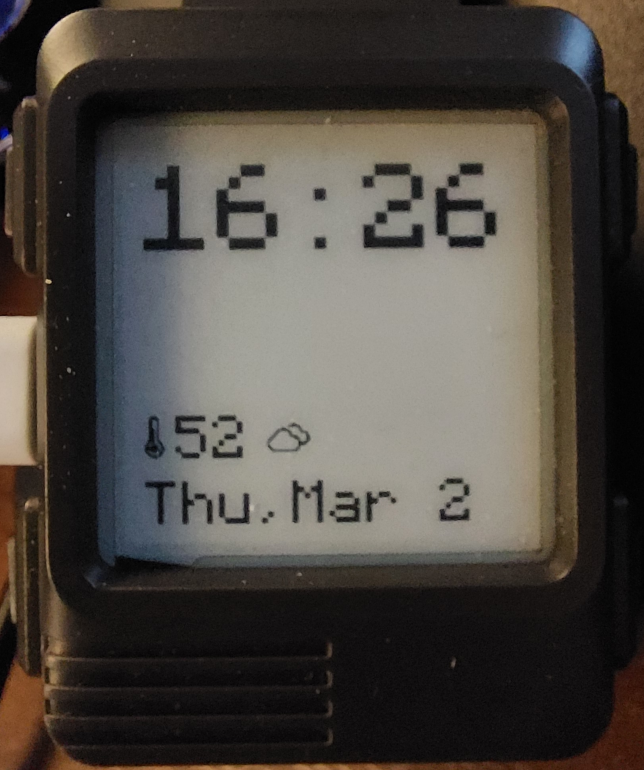

# Watchy Micropython Playground

Testing MicroPython with Watchy ESP32 hardware.

## Setup

The files inside the `upload` directory should be copied to your Watchy device after MicroPython has been setup. Installation notes can be found on the [Community Wiki](https://watchy-community.github.io/wiki/#/micropython/setup).

### Config File

The file `/upload/src/config.py` is used as a configuration/settings file. You should only need to add your trusted wireless networks as tuples, and modify the Open-Meteo arguments. The WorldTimeAPI, which is used for NTP sync, will use the `weatherTZ` for its own timezone look up as well.

## ToDo

- [ ] Grab forecast weather instead of current, use on screen updates
  - [ ] Grab 24 hour forecast, write to file
  - [ ] Modify read function to look up current hour forecast
- [ ] Clean-up ePaper partial updates
  - Current partial is real grainy and hard to read
  - Peter Hinch has been working on partial epaper updates for the [Waveshare Pico](https://github.com/peterhinch/micropython-nano-gui/blob/master/drivers/epaper/pico_epaper_42.py), is his code adaptable?
- [ ] Monitor watchy voltages, adjust battery icon ranges
  - Max is 4V (I'm seeing 4.01x or 4.02x)
  - Min is 2.66? - Still monitoring and testing
- [ ] Add docstrings to libraries, clean up errors/warnings
  - [ ] writer needs docstrings added
  - [ ] can display/epaper/writer be refactored/combined/slimmed down?
- [ ] Reduce memory usage
  - [ ] Change [const() with prefix _](https://docs.micropython.org/en/latest/develop/optimizations.html#variables)
  - [ ] [Cross-compile lib files as mpy](https://docs.micropython.org/en/latest/develop/optimizations.html#frozen-bytecode)
  - [ ] Cross-compile font files as mpy
- [ ] Work with others to integrate the v1 and v1.5 hardware code
  - Have both PCF8563 and DS3231 libraries on the watch, load the appropriate driver
  - How to identify v1/v1.5/v2 so we can re-map ADC and BTN3 pins, might need to be a `config.py`/manual user process
    - Maybe add WATCHY_VERSION to boot.py?

## Issues

- It is not possible to get the wakeup bit in MicroPython yet, see [GH: micropython/issues/6981](https://github.com/micropython/micropython/issues/6981)
  - tl;dr: There is a delay in the wakeup process, by the time the ESP32 wakes up the MicroPython bit used to track the individual buttons is lost.

## References

- [Github: hueyy/watchy_py](https://github.com/hueyy/watchy_py) - this project is largely based on this code
- [Github: mcauser/micropython-waveshare-epaper](https://github.com/mcauser/micropython-waveshare-epaper) - ePaper driver
- [Github: peterhinch/micropython-font-to-py](https://github.com/peterhinch/micropython-font-to-py) - Writer interface and font-to-py script
- [Github: lewisxhe/PCF8563_PythonLibrary](https://github.com/lewisxhe/PCF8563_PythonLibrary) - RTC driver for Watchy v2
- [Sync time in MicroPython using NTP](https://bhave.sh/micropython-ntp/) - used section on Timezones
- [ESP32/ESP8266 Analog Readings with MicroPython | Random Nerd Tutorials](https://randomnerdtutorials.com/esp32-esp8266-analog-readings-micropython/)
- [MicroPython Documentation](https://docs.micropython.org/en/latest/)
- [WorldTimeAPI](http://worldtimeapi.org/) - Gives us time JSON response for specific time zones, including DST true/false

## Hardware/Datasheets

- Microcontroller: [ESP32-PICO-D4](https://www.espressif.com/sites/default/files/documentation/esp32-pico-d4_datasheet_en.pdf)
- USB-Serial: [CP2104](https://www.silabs.com/documents/public/data-sheets/cp2104.pdf)
- E-Paper Display: [GDEH0154D67](https://www.e-paper-display.com/products_detail/productId=455.html)
  - Watchy screen is 200x200
  - at 48px font, it is 5 characters wide
  - at 32px font, it is 8 characters wide
  - at 24px font, it is 10 characters wide
- Display Connector: [AFC07-S24ECC-00](https://datasheet.lcsc.com/szlcsc/1811021340_JUSHUO-AFC07-S24ECC-00_C11092.pdf)
- 3-Axis Accelerometer: [BMA423](https://watchy.sqfmi.com/assets/files/BST-BMA423-DS000-1509600-950150f51058597a6234dd3eaafbb1f0.pdf)
- Real Time Clock v1.5/2.0: [PCF8563](https://www.mouser.com/datasheet/2/302/PCF8563-1127619.pdf)
- Battery: [LiPo 3.7V 200mAH](https://www.powerstream.com/lip/GMB042030.pdf)
- LDO Voltage Regulator: [ME6211C33M5G-N](https://datasheet.lcsc.com/szlcsc/Nanjing-Micro-One-Elec-ME6211C33M5G-N_C82942.pdf)
- Battery Connector: [BOOMELE 1.25T-2PWT](https://datasheet.lcsc.com/szlcsc/1811092210_BOOMELE-Boom-Precision-Elec-1-25T-2PWT_C22074.pdf)
- Micro-USB Connector: [U-F-M5DD-Y-L](https://datasheet.lcsc.com/szlcsc/1811131825_Korean-Hroparts-Elec-U-F-M5DD-Y-L_C91146.pdf)
- Tactile Buttons: [K2-1114SA-A4SW-06](https://datasheet.lcsc.com/szlcsc/1810061013_Korean-Hroparts-Elec-K2-1114SA-A4SW-06_C136662.pdf)
- Vibration Motor: [1020](https://github.com/SeeedDocument/Bazaar_doc/raw/master/316040001/1020_datasheet.doc)
- PCB Antenna: [SWRA117D](https://www.ti.com/lit/an/swra117d/swra117d.pdf)
